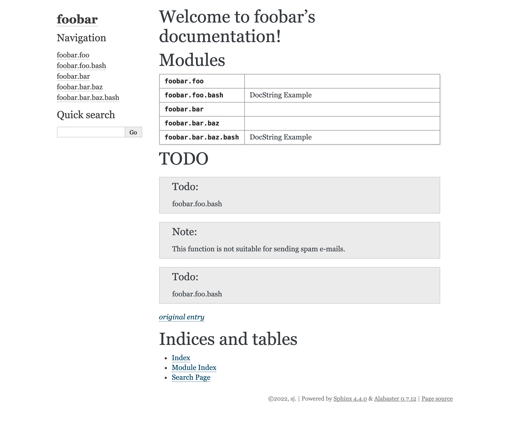

## Setup
### Sphinx
- First pip installed sphinx and tested ```sphinx-build --version```
- Then created ./docs directory at the same level as the python project ```sphinx-quickstart docs``` with the following wizard values
  - create separate directory for build/source
  - ....
- Then followed this [link](https://www.sphinx-doc.org/en/master/man/sphinx-autogen.html)
  - created this directory structure
  ```
  foobar
    ├── foo
    │   └── __init__.py
    └── bar
    ├── __init__.py
    └── baz
        └── __init__.py
  ```
  - Added this to docs/index.rst
  ```
  Modules
    =======
    
    .. autosummary::
       :toctree: modules
    
       foobar.foo
       foobar.bar
       foobar.bar.baz
  ```
  - At the project level, run the following command to create stub files ```PYTHONPATH=. sphinx-autogen docs/source/index.rst```. This will create autodoc directives amongst other things. Or run ```sphinx-apidoc -o docs_foobar/source/modules foobar``` i.e. <output_path> <and module_path>
  - Add this to source/conf.py [extensions]....```'sphinx.ext.autodoc'``` [link](https://www.sphinx-doc.org/en/master/usage/extensions/autodoc.html)
  - At the project level, build the HTML files ```sphinx-build -b html docs_foobar/source/ docs_foobar/build_foobar/html``` **NB. could always rename to e.g. docs/build_foobar/html** and refactor this line

**Example output**


### Pyan - Callgraph
- ```pyan3 *.py --uses --no-defines --colored --grouped --annotated --html > callgraph.html``` to build a non-zoomable html to show a call dependency graph between functions

**Example output**



## What next
1. Consider other [directives/extensions](https://www.sphinx-doc.org/en/master/usage/extensions/index.html) **Can have your own extensions**
2. How to pull in #TODO (similarly for #FIXME)...and other [codetags](https://www.python.org/dev/peps/pep-0350/)
3. Use [pyan3==1.1.1](https://github.com/davidfraser/pyan) that determines a call dependency graph between functions and methods. 